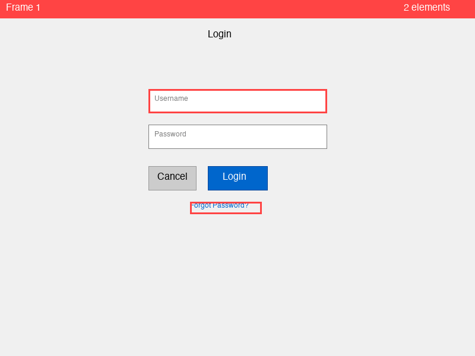
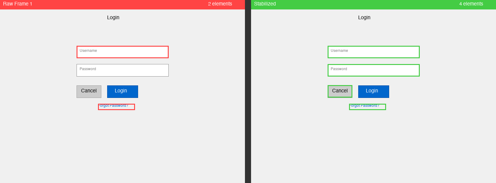
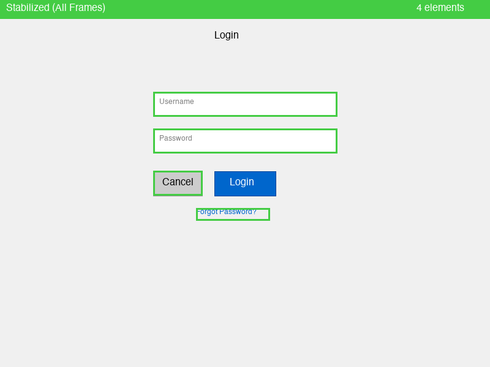
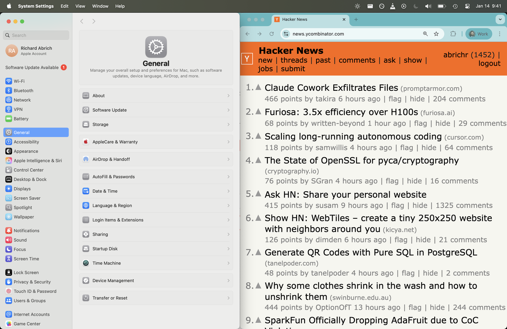
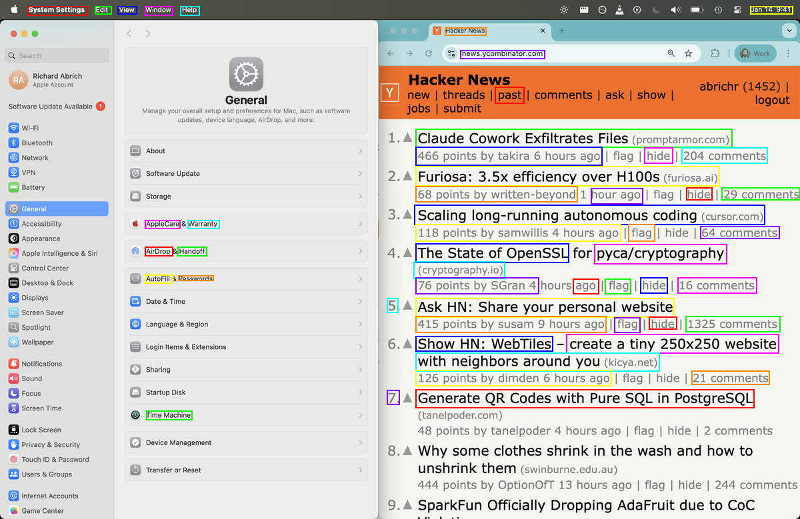
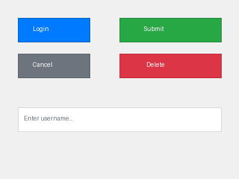
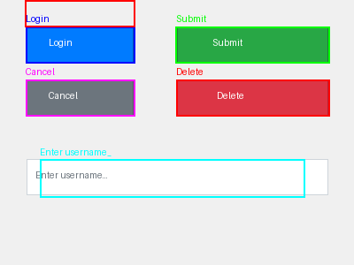

# OpenAdapt Grounding

**Robust UI element localization for automation.**

Turn flakey single-frame detections into stable, reliable element coordinates.

## The Problem

Vision models like OmniParser miss elements randomly frame-to-frame ("flickering"). Template matching breaks with resolution/theme changes.



*Left: Raw detections showing frame-to-frame flickering*

## The Solution

1. **Temporal Smoothing**: Aggregate detections across frames, keep only stable elements
2. **Text Anchoring**: Match elements by OCR text (resolution-independent)



*Side-by-side: Raw flickering (left) vs Stabilized detection (right)*

## Results

### Detection Stability

| Metric | Raw (30% dropout) | Stabilized |
|--------|-------------------|------------|
| Avg Detection Rate | ~60-70% | **80-100%** |
| Min Detection Rate | ~40% | **Consistent** |
| Consistency | Flickering | **Stable** |

### Resolution Robustness

| Scale | Resolution | Elements Found | Status |
|-------|------------|----------------|--------|
| 1.0x | 800x600 | All | ✓ |
| 1.25x | 1000x750 | All | ✓ |
| 1.5x | 1200x900 | All | ✓ |
| 2.0x | 1600x1200 | All | ✓ |

### Visual Output



*Stable elements after temporal filtering*

## Quick Start

```bash
uv pip install openadapt-grounding
```

### Build a Registry (Offline)

```python
from openadapt_grounding import RegistryBuilder, Element

# Add detections from multiple frames
builder = RegistryBuilder()
builder.add_frame([
    Element(bounds=(0.3, 0.2, 0.2, 0.05), text="Login"),
    Element(bounds=(0.3, 0.3, 0.2, 0.05), text="Cancel"),
])
# ... add more frames

# Build registry (keeps elements in >50% of frames)
registry = builder.build(min_stability=0.5)
registry.save("elements.json")
```

### Locate Elements (Runtime)

```python
from openadapt_grounding import ElementLocator
from PIL import Image

locator = ElementLocator("elements.json")
screenshot = Image.open("current_screen.png")

result = locator.find("Login", screenshot)
if result.found:
    # Normalized coordinates (0-1)
    print(f"Found at ({result.x:.2f}, {result.y:.2f})")

    # Convert to pixels
    px, py = result.to_pixels(width=1920, height=1080)
    print(f"Click at ({px}, {py})")
```

## Run Demo

```bash
uv run python -m openadapt_grounding.demo
```

Output:
```
============================================================
OpenAdapt Grounding Demo Results
============================================================

Registry: 5 stable elements

📊 Detection Stability:
  Raw (with 30% dropout):    70%
  Stabilized (filtered):     100%
  Improvement:               +30%

📐 Resolution Robustness:
  ✓ 1.0x (800x600): 5 elements
  ✓ 1.25x (1000x750): 5 elements
  ✓ 1.5x (1200x900): 5 elements
  ✓ 2.0x (1600x1200): 5 elements

📁 Outputs saved to: demo_output/
```

## How It Works

### Temporal Clustering

```
Frame 1: [Login ✓] [Cancel ✓] [Password ✗]  → 2/3 detected
Frame 2: [Login ✓] [Cancel ✗] [Password ✓]  → 2/3 detected
Frame 3: [Login ✓] [Cancel ✓] [Password ✓]  → 3/3 detected
...
After 10 frames:
  - "Login" seen 9/10 times → KEEP (90% stability)
  - "Cancel" seen 7/10 times → KEEP (70% stability)
  - "Password" seen 8/10 times → KEEP (80% stability)
```

### Text-Based Matching

At runtime, we use OCR to find text on screen, then match against the registry:

```python
# Registry knows "Login" button exists
# OCR finds "Login" text at (0.45, 0.35)
# → Return those coordinates with high confidence
```

## OmniParser Integration

Use with [OmniParser](https://github.com/microsoft/OmniParser) for real UI element detection:

### Deploy OmniParser Server

```bash
# Install deploy dependencies
uv pip install openadapt-grounding[deploy]

# Set AWS credentials (or use .env file)
cp .env.example .env
# Edit .env with your AWS credentials

# Deploy to EC2 (g6.xlarge with L4 GPU)
uv run python -m openadapt_grounding.deploy start

# Stop when done (terminates instance)
uv run python -m openadapt_grounding.deploy stop
```

### Monitor Deployment

```bash
# Check instance and server status
$ uv run python -m openadapt_grounding.deploy status
Instance: i-0f57529053cb507ca | State: running | URL: http://98.92.234.13:8000
Auto-shutdown: Enabled (60 min timeout)

# Show container status
$ uv run python -m openadapt_grounding.deploy ps
CONTAINER ID   IMAGE               CREATED          STATUS          PORTS                    NAMES
c9343a65e85b   omniparser:latest   2 hours ago      Up 2 hours      0.0.0.0:8000->8000/tcp   omniparser-container

# View container logs
$ uv run python -m openadapt_grounding.deploy logs --lines=5
INFO:     99.230.67.57:61252 - "POST /parse/ HTTP/1.1" 200 OK
start parsing...
image size: (1200, 779)
len(filtered_boxes): 160 124
time: 4.438266754150391

# Test endpoint with synthetic image
$ uv run python -m openadapt_grounding.deploy test
Server is healthy!
Sending test image to server...
Found 5 elements:
  - [text] "Login" at ['0.08', '0.10', '0.38', '0.23']
  - [text] "Cancel" at ['0.08', '0.30', '0.38', '0.43']
  ...
```

### Other Commands

```bash
uv run python -m openadapt_grounding.deploy build   # Rebuild Docker image
uv run python -m openadapt_grounding.deploy run     # Start container
uv run python -m openadapt_grounding.deploy ssh     # SSH into instance
```

### Test Results

**Real screenshot parsed by OmniParser:**

| Input | Output (160 elements detected) |
|-------|--------|
|  |  |

**Synthetic UI test:**

| Input | Output |
|-------|--------|
|  |  |

```bash
# Run test with synthetic UI
uv run python -m openadapt_grounding.deploy test --save_output
```

### Use OmniParser with Temporal Smoothing

```python
from openadapt_grounding import OmniParserClient, collect_frames
from PIL import Image

# Connect to deployed server
client = OmniParserClient("http://<server-ip>:8000")

# Take a screenshot
screenshot = Image.open("screen.png")

# Run parser 10 times, keep elements in >50% of frames
registry = collect_frames(client, screenshot, num_frames=10, min_stability=0.5)
registry.save("stable_elements.json")

print(f"Found {len(registry)} stable elements")
```

### Analyze Detection Stability

```python
from openadapt_grounding import OmniParserClient, analyze_stability

client = OmniParserClient("http://<server-ip>:8000")
stats = analyze_stability(client, screenshot, num_frames=10)

print(f"Average stability: {stats['avg_stability']:.0%}")
for elem in stats['elements']:
    print(f"  {elem['text']}: {elem['stability']:.0%}")
```

## API

### `RegistryBuilder`
- `add_frame(elements)` - Add a frame's detections
- `build(min_stability=0.5)` - Build registry, filtering unstable elements

### `ElementLocator`
- `find(query, screenshot)` - Find element by text
- `find_by_uid(uid, screenshot)` - Find element by registry UID

### `LocatorResult`
- `found: bool` - Whether element was found
- `x, y: float` - Normalized coordinates (0-1)
- `confidence: float` - Match confidence
- `to_pixels(w, h)` - Convert to pixel coordinates

### `OmniParserClient`
- `is_available()` - Check if server is running
- `parse(image)` - Parse screenshot, return elements
- `parse_with_metadata(image)` - Parse with latency info

### `collect_frames(parser, image, num_frames, min_stability)`
- Run parser multiple times, build stable registry

### `analyze_stability(parser, image, num_frames)`
- Report per-element detection stability

## Documentation

| Document | Description |
|----------|-------------|
| [Literature Review](docs/literature_review.md) | SOTA analysis: UI-TARS (61.6%), OmniParser (39.6%), ScreenSeekeR cropping |
| [Experiment Plan](docs/experiment_plan.md) | Comparison methodology: 6 methods, 3 datasets, evaluation metrics |
| [Evaluation Harness](docs/evaluation.md) | Benchmarking framework, dataset formats, CLI usage |

### Key Findings

- **UI-TARS 1.5** achieves 61.6% on ScreenSpot-Pro (vs OmniParser's 39.6%)
- **Progressive cropping** (ScreenSeekeR) improves accuracy by +254%
- **Small icons** (<32px) remain the hardest challenge

## Development

```bash
git clone https://github.com/OpenAdaptAI/openadapt-grounding
cd openadapt-grounding
uv venv && uv pip install -e ".[dev]"
uv run pytest
```

## License

MIT
