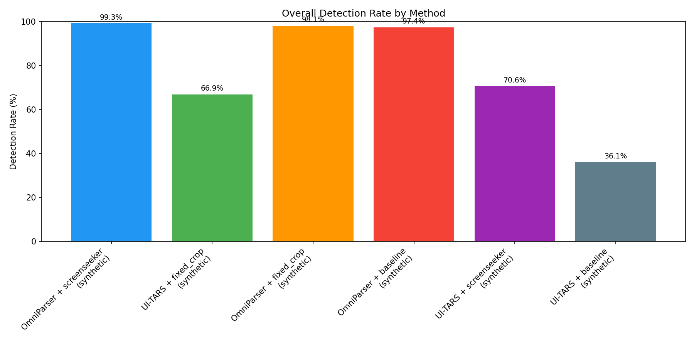
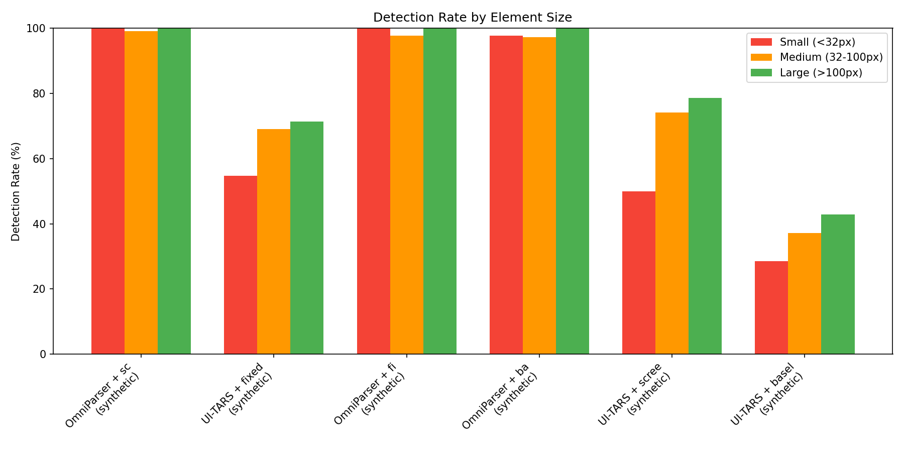
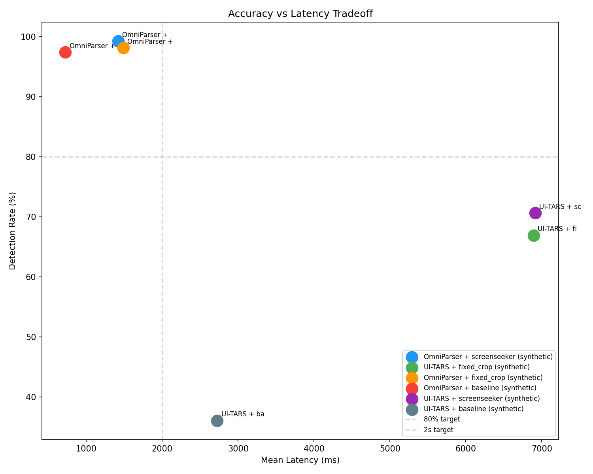
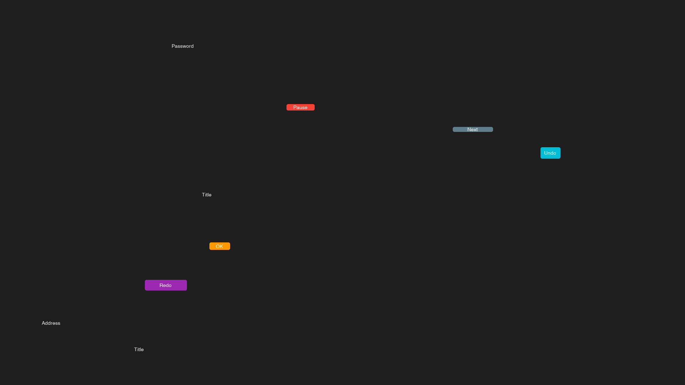

# OpenAdapt Grounding

> [!IMPORTANT]
> **Status: Research. Not required by the product.** This package explores
> making grounding-model detections stable for GUI element localization. Healthy
> compiled replays make no model calls; a grounding model is an optional,
> explicitly enabled fallback rung, and this research is not part of that
> supported path.
>
> The OpenAdapt product is the demonstration compiler,
> [`openadapt-flow`](https://github.com/OpenAdaptAI/openadapt-flow), installed
> via the [`OpenAdapt`](https://github.com/OpenAdaptAI/OpenAdapt) launcher
> (`pip install openadapt`): it compiles a demonstrated GUI workflow into a
> deterministic, locally executable program. Healthy runs make no model calls,
> and it halts instead of guessing when verification fails. Lifecycle labels for
> every repository are in the
> [repository lifecycle registry](https://github.com/OpenAdaptAI/.github/blob/main/REPOSITORY_LIFECYCLE.md).

[](https://github.com/OpenAdaptAI/openadapt-grounding/actions/workflows/release.yml)
[](https://pypi.org/project/openadapt-grounding/)
[](https://pypi.org/project/openadapt-grounding/)
[](https://opensource.org/licenses/MIT)
[](https://www.python.org/downloads/)

**Robust UI element localization for automation.**

Turn flaky single-frame detections into stable, reliable element coordinates.

## Where it fits

A compiled OpenAdapt workflow replays deterministically and makes no model calls
on the healthy path. Grounding is only needed when a target must be relocated,
and it is arranged as a ladder from cheapest to most expensive:

1. **OCR text-anchoring (primary local rung).** `ElementLocator` matches an
   element by its OCR text against a registry of stable elements. It runs
   locally on the CPU through Tesseract, needs no paid API and no GPU, and is
   resolution-independent because it anchors on text rather than pixels. This is
   the rung this package leads with.
2. **Optional model grounders (explicitly enabled fallback).** When text
   anchoring is not enough you can enable a grounding model: a self-hosted
   [OmniParser](https://github.com/microsoft/OmniParser) or
   [UI-TARS](https://github.com/bytedance/UI-TARS) server (each needs a GPU), or
   a hosted VLM provider (`get_provider("anthropic" | "openai" | "google")`,
   each needs a paid API key). Temporal smoothing stabilizes their otherwise
   flaky frame-to-frame detections.

## The OpenAdapt stack

OpenAdapt is a governed demonstration compiler: record a workflow once, compile
the recording into a deterministic program, and replay that program with zero
model calls on the healthy path. When the live screen does not match what was
demonstrated it halts instead of guessing, using identity gates and independent
effect verification. Every substrate is first-class: web and desktop recording
are validated, RDP and Windows replay are early, and Citrix is exploratory.

| Package | Role |
| --- | --- |
| [`openadapt`](https://github.com/OpenAdaptAI/OpenAdapt) | Launcher and installer (`pip install openadapt`) |
| [`openadapt-flow`](https://github.com/OpenAdaptAI/openadapt-flow) | Records, compiles, verifies, and replays workflows |
| [`openadapt-capture`](https://github.com/OpenAdaptAI/openadapt-capture) | Cross-platform local desktop recording |
| [`openadapt-types`](https://github.com/OpenAdaptAI/openadapt-types) | Canonical action and UI-state schema |
| **`openadapt-grounding`** | Local OCR text-anchoring plus optional model grounding (this package) |
| [`openadapt-privacy`](https://github.com/OpenAdaptAI/openadapt-privacy) | PHI/PII detection and redaction |

Documentation for the whole stack lives at
[docs.openadapt.ai](https://docs.openadapt.ai).

## The Problem

Vision models like OmniParser miss elements randomly frame-to-frame ("flickering"). Template matching breaks with resolution/theme changes.


*Left: Raw detections showing frame-to-frame flickering*

## The Solution

1. **Temporal Smoothing**: Aggregate detections across frames, keep only stable elements
2. **Text Anchoring**: Match elements by OCR text (resolution-independent)


*Side-by-side: Raw flickering (left) vs Stabilized detection (right)*

## Results

### Detection Stability

| Metric | Raw (30% dropout) | Stabilized |
|--------|-------------------|------------|
| Avg Detection Rate | ~60-70% | **80-100%** |
| Min Detection Rate | ~40% | **Consistent** |
| Consistency | Flickering | **Stable** |

### Resolution Robustness

| Scale | Resolution | Elements Found | Status |
|-------|------------|----------------|--------|
| 1.0x | 800x600 | All | ✓ |
| 1.25x | 1000x750 | All | ✓ |
| 1.5x | 1200x900 | All | ✓ |
| 2.0x | 1600x1200 | All | ✓ |

### Visual Output


*Stable elements after temporal filtering*

## Quick Start

```bash
pip install openadapt-grounding
```

The local OCR rung uses [Tesseract](https://github.com/tesseract-ocr/tesseract)
through `pytesseract`, so install the Tesseract binary as well (for example
`brew install tesseract` on macOS or `apt-get install tesseract-ocr` on Debian
or Ubuntu). No GPU or paid API key is required for this rung.

### Build a Registry (Offline)

```python
from openadapt_grounding import RegistryBuilder, Element

# Add detections from multiple frames
builder = RegistryBuilder()
builder.add_frame([
    Element(bounds=(0.3, 0.2, 0.2, 0.05), text="Login"),
    Element(bounds=(0.3, 0.3, 0.2, 0.05), text="Cancel"),
])
# ... add more frames

# Build registry (keeps elements in >50% of frames)
registry = builder.build(min_stability=0.5)
registry.save("elements.json")
```

### Locate Elements (Runtime)

```python
from openadapt_grounding import ElementLocator
from PIL import Image

locator = ElementLocator("elements.json")
screenshot = Image.open("current_screen.png")

result = locator.find("Login", screenshot)
if result.found:
    # Normalized coordinates (0-1)
    print(f"Found at ({result.x:.2f}, {result.y:.2f})")

    # Convert to pixels
    px, py = result.to_pixels(width=1920, height=1080)
    print(f"Click at ({px}, {py})")
```

## Run Demo

```bash
uv run python -m openadapt_grounding.demo
```

Output:
```
============================================================
OpenAdapt Grounding Demo Results
============================================================

Registry: 5 stable elements

📊 Detection Stability:
  Raw (with 30% dropout):    70%
  Stabilized (filtered):     100%
  Improvement:               +30%

📐 Resolution Robustness:
  ✓ 1.0x (800x600): 5 elements
  ✓ 1.25x (1000x750): 5 elements
  ✓ 1.5x (1200x900): 5 elements
  ✓ 2.0x (1600x1200): 5 elements

📁 Outputs saved to: demo_output/
```

## How It Works

### Temporal Clustering

```
Frame 1: [Login ✓] [Cancel ✓] [Password ✗]  → 2/3 detected
Frame 2: [Login ✓] [Cancel ✗] [Password ✓]  → 2/3 detected
Frame 3: [Login ✓] [Cancel ✓] [Password ✓]  → 3/3 detected
...
After 10 frames:
  - "Login" seen 9/10 times → KEEP (90% stability)
  - "Cancel" seen 7/10 times → KEEP (70% stability)
  - "Password" seen 8/10 times → KEEP (80% stability)
```

### Text-Based Matching

At runtime, we use OCR to find text on screen, then match against the registry:

```python
# Registry knows "Login" button exists
# OCR finds "Login" text at (0.45, 0.35)
# → Return those coordinates with high confidence
```

## OmniParser Integration

Use with [OmniParser](https://github.com/microsoft/OmniParser) for real UI element detection:

### Deploy OmniParser Server

```bash
# Install deploy dependencies
uv pip install openadapt-grounding[deploy]

# Set AWS credentials (or use .env file)
cp .env.example .env
# Edit .env with your AWS credentials

# Deploy to EC2 (g6.xlarge with L4 GPU)
uv run python -m openadapt_grounding.deploy start

# Stop when done (terminates instance)
uv run python -m openadapt_grounding.deploy stop
```

### Monitor Deployment

```bash
# Check instance and server status
$ uv run python -m openadapt_grounding.deploy status
Instance: i-0f57529053cb507ca | State: running | URL: http://98.92.234.13:8000
Auto-shutdown: Enabled (60 min timeout)

# Show container status
$ uv run python -m openadapt_grounding.deploy ps
CONTAINER ID   IMAGE               CREATED          STATUS          PORTS                    NAMES
c9343a65e85b   omniparser:latest   2 hours ago      Up 2 hours      0.0.0.0:8000->8000/tcp   omniparser-container

# View container logs
$ uv run python -m openadapt_grounding.deploy logs --lines=5
INFO:     99.230.67.57:61252 - "POST /parse/ HTTP/1.1" 200 OK
start parsing...
image size: (1200, 779)
len(filtered_boxes): 160 124
time: 4.438266754150391

# Test endpoint with synthetic image
$ uv run python -m openadapt_grounding.deploy test
Server is healthy!
Sending test image to server...
Found 5 elements:
  - [text] "Login" at ['0.08', '0.10', '0.38', '0.23']
  - [text] "Cancel" at ['0.08', '0.30', '0.38', '0.43']
  ...
```

### Other Commands

```bash
uv run python -m openadapt_grounding.deploy build   # Rebuild Docker image
uv run python -m openadapt_grounding.deploy run     # Start container
uv run python -m openadapt_grounding.deploy ssh     # SSH into instance
```

### Test Results

**Real screenshot parsed by OmniParser:**

| Input | Output (160 elements detected) |
|-------|--------|
|  |  |

**Synthetic UI test:**

| Input | Output |
|-------|--------|
|  |  |

```bash
# Run test with synthetic UI
uv run python -m openadapt_grounding.deploy test --save_output
```

### Use OmniParser with Temporal Smoothing

```python
from openadapt_grounding import OmniParserClient, collect_frames
from PIL import Image

# Connect to deployed server
client = OmniParserClient("http://<server-ip>:8000")

# Take a screenshot
screenshot = Image.open("screen.png")

# Run parser 10 times, keep elements in >50% of frames
registry = collect_frames(client, screenshot, num_frames=10, min_stability=0.5)
registry.save("stable_elements.json")

print(f"Found {len(registry)} stable elements")
```

### Analyze Detection Stability

```python
from openadapt_grounding import OmniParserClient, analyze_stability

client = OmniParserClient("http://<server-ip>:8000")
stats = analyze_stability(client, screenshot, num_frames=10)

print(f"Average stability: {stats['avg_stability']:.0%}")
for elem in stats['elements']:
    print(f"  {elem['text']}: {elem['stability']:.0%}")
```

## UI-TARS Integration

[UI-TARS 1.5](https://github.com/bytedance/UI-TARS) is ByteDance's SOTA UI grounding model (61.6% on ScreenSpot-Pro). Use it for direct element localization by instruction.

### Deploy UI-TARS Server

```bash
# Install dependencies
uv pip install openadapt-grounding[deploy,uitars]

# Deploy to EC2 (g6.2xlarge with L4 GPU)
uv run python -m openadapt_grounding.deploy.uitars start

# Check status
uv run python -m openadapt_grounding.deploy.uitars status

# Test grounding
uv run python -m openadapt_grounding.deploy.uitars test

# Stop when done
uv run python -m openadapt_grounding.deploy.uitars stop
```

### Use UI-TARS for Grounding

```python
from openadapt_grounding import UITarsClient
from PIL import Image

# Connect to deployed server
client = UITarsClient("http://<server-ip>:8001/v1")

# Load screenshot
screenshot = Image.open("screen.png")

# Ground element by instruction
result = client.ground(screenshot, "Click on the Login button")

if result.found:
    # Normalized coordinates (0-1)
    print(f"Found at ({result.x:.2f}, {result.y:.2f})")

    # Convert to pixels
    px, py = result.to_pixels(width=1920, height=1080)
    print(f"Click at ({px}, {py})")

    # Optional: View model's reasoning
    if result.thought:
        print(f"Thought: {result.thought}")
```

### OmniParser vs UI-TARS

| Feature | OmniParser | UI-TARS |
|---------|------------|---------|
| Approach | Parse all elements | Ground by query |
| Output | List of bboxes | Single click point |
| Best for | Enumeration, registry building | Direct element finding |
| **Detection Rate** (our benchmark) | **99.3%** | 70.6% |
| **Latency** (per element) | **~1.4s** | ~6.9s |

## Evaluation & Benchmarking

We provide a comprehensive evaluation framework to compare UI grounding methods.

### Benchmark Results

Evaluated on synthetic dataset (100 samples, 1922 UI elements):

| Method | Detection Rate | IoU | Latency | Attempts |
|--------|---------------|-----|---------|----------|
| **OmniParser + screenseeker** | **99.3%** | 0.690 | 1418ms | 2.0 |
| OmniParser + fixed | 98.1% | 0.681 | 1486ms | 2.2 |
| OmniParser baseline | 97.4% | 0.648 | 724ms | 1.0 |
| UI-TARS + screenseeker | 70.6% | - | 6914ms | 2.3 |
| UI-TARS + fixed | 66.9% | - | 6891ms | 2.4 |
| UI-TARS baseline | 36.1% | - | 2724ms | 1.0 |

**On Harder Synthetic Data** (48 samples, 1035 elements - more dense, smaller targets):

| Method | Detection Rate | Change from Standard |
|--------|---------------|----------------------|
| **OmniParser + fixed** | **98.2%** | +0.1% |
| OmniParser + screenseeker | 96.6% | -2.7% |
| OmniParser baseline | 90.1% | -7.3% |

**Key Findings:**
1. Cropping strategies dramatically improve UI-TARS accuracy (+96% with screenseeker) but have minimal effect on OmniParser on standard data
2. On harder data, **cropping becomes essential** - OmniParser baseline drops 7.3% but fixed cropping maintains 98%+ accuracy
3. OmniParser is 3.8-5x faster than UI-TARS while being significantly more accurate

### Detection Rate by Method



### Detection Rate by Element Size



Small elements (<32px) are hardest for UI-TARS (28.6% → 50% with cropping), while OmniParser maintains ~100% across all sizes.

### Accuracy vs Latency Tradeoff



OmniParser offers the best accuracy-latency tradeoff, with near-perfect detection at <1.5s per element.

### Synthetic Dataset Samples

The evaluation uses programmatically generated UI screenshots with ground truth:

| Easy (3-8 elements) | Hard (20-50 elements, dark theme) |
|---------------------|-----------------------------------|
|  |  |

### Run Your Own Evaluation

```bash
# Install dependencies
uv pip install openadapt-grounding[eval]

# Generate synthetic dataset
uv run python -m openadapt_grounding.eval generate --type synthetic --count 100

# Run evaluation (requires deployed servers)
uv run python -m openadapt_grounding.eval run --method omniparser --dataset synthetic
uv run python -m openadapt_grounding.eval run --method uitars --dataset synthetic

# With cropping strategies
uv run python -m openadapt_grounding.eval run --method omniparser-screenseeker --dataset synthetic
uv run python -m openadapt_grounding.eval run --method uitars-screenseeker --dataset synthetic

# Generate comparison charts
uv run python -m openadapt_grounding.eval compare --charts-dir evaluation/charts
```

### Available Methods

| Method | Description |
|--------|-------------|
| `omniparser` | OmniParser baseline (full image) |
| `omniparser-fixed` | OmniParser + fixed cropping (200, 300, 500px) |
| `omniparser-screenseeker` | OmniParser + heuristic UI region cropping |
| `uitars` | UI-TARS baseline (full image) |
| `uitars-fixed` | UI-TARS + fixed cropping |
| `uitars-screenseeker` | UI-TARS + heuristic UI region cropping |

See [Evaluation Documentation](docs/evaluation.md) for methodology and metrics.

## API

### `RegistryBuilder`
- `add_frame(elements)` - Add a frame's detections
- `build(min_stability=0.5)` - Build registry, filtering unstable elements

### `ElementLocator`
- `find(query, screenshot)` - Find element by text
- `find_by_uid(uid, screenshot)` - Find element by registry UID

### `LocatorResult`
- `found: bool` - Whether element was found
- `x, y: float` - Normalized coordinates (0-1)
- `confidence: float` - Match confidence
- `to_pixels(w, h)` - Convert to pixel coordinates

### `OmniParserClient`
- `is_available()` - Check if server is running
- `parse(image)` - Parse screenshot, return elements
- `parse_with_metadata(image)` - Parse with latency info

### `UITarsClient`
- `is_available()` - Check if server is running
- `ground(image, instruction)` - Find element by instruction, return `GroundingResult`

### `GroundingResult`
- `found: bool` - Whether element was found
- `x, y: float` - Normalized coordinates (0-1)
- `confidence: float` - Match confidence
- `thought: str` - Model's reasoning (if include_thought=True)
- `to_pixels(w, h)` - Convert to pixel coordinates

### `collect_frames(parser, image, num_frames, min_stability)`
- Run parser multiple times, build stable registry

### `analyze_stability(parser, image, num_frames)`
- Report per-element detection stability

## Documentation

| Document | Description |
|----------|-------------|
| [Evaluation Findings](docs/evaluation_findings.md) | Analysis of why OmniParser outperforms UI-TARS on our task |
| [Literature Review](docs/literature_review.md) | SOTA analysis: UI-TARS (61.6%), OmniParser (39.6%), ScreenSeekeR cropping |
| [Experiment Plan](docs/experiment_plan.md) | Comparison methodology: 6 methods, 3 datasets, evaluation metrics |
| [Evaluation Harness](docs/evaluation.md) | Benchmarking framework, dataset formats, CLI usage |
| [UI-TARS Deployment](docs/uitars_deployment_design.md) | UI-TARS deployment design, vLLM setup, API format |

### Key Findings

From our benchmark on synthetic UI data:

- **OmniParser dominates on our task**: 97-99% detection vs UI-TARS's 36-70%
- **Cropping becomes essential on harder data**: OmniParser baseline drops to 90%, but fixed cropping maintains 98%+
- **OmniParser is 3.8-5x faster** than UI-TARS while being more accurate
- **Literature benchmarks don't transfer directly**: UI-TARS leads on ScreenSpot-Pro (complex instruction-following) but OmniParser wins on element detection
- **Small elements** (<32px) remain hardest for UI-TARS (28.6% baseline → 50% with cropping)

See [Evaluation Findings](docs/evaluation_findings.md) for analysis of why results differ from literature benchmarks.

## Development

```bash
git clone https://github.com/OpenAdaptAI/openadapt-grounding
cd openadapt-grounding
uv sync
uv run pytest
```

## License

MIT
